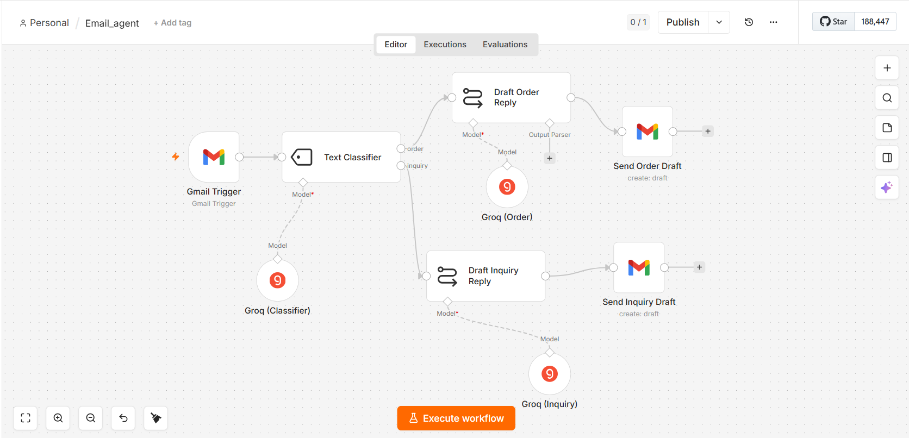

# Email Agent 📧

An AI-powered email automation agent built with **n8n** that automatically classifies incoming Gmail messages and drafts intelligent replies using **Groq LLM (Llama 3.1 8B Instant)** and **LangChain**.

---

## 💡 What It Does

* **Monitors Inbox:** Listens for incoming messages via Gmail Trigger.
* **Smart Intent Classification:** Uses an LLM-backed Text Classifier to categorize emails into **Order** or **Inquiry**.
* **AI Reply Generation:** Automatically drafts context-aware, polite responses using Groq AI.
* **Human-in-the-Loop Guardrail:** Saves drafted replies back to Gmail Drafts so you can review and edit them before sending.

---

## 🏗 System Architecture & Workflow Sketch

[ Gmail Trigger (Polls every 1 min) ]
                  │
                  ▼
   [ Text Classifier Node (LangChain) ]
       │                         │
  (Order Path)             (Inquiry Path)
       │                         │
       ▼                         ▼
[ Draft Order Reply ]     [ Draft Inquiry Reply ]
 (Llama 3.1 8B Instant)    (Llama 3.1 8B Instant)
       │                         │
       ▼                         ▼
[ Send Order Draft ]      [ Send Inquiry Draft ]
  (Gmail Node: Draft)       (Gmail Node: Draft)

## 🛠 Tools & Services Used

| Tool / Node | Purpose |
| :--- | :--- |
| **Gmail Trigger** | Monitors inbox for new emails |
| **Text Classifier** | Categorizes email intent (Order vs. Inquiry) |
| **Groq (Classifier)** | LLM model (`llama-3.1-8b-instant`) powering classification |
| **Groq (Order)** | Drafts polite, structured replies for order emails |
| **Groq (Inquiry)** | Drafts detailed replies for customer inquiries |
| **Gmail (Draft)** | Saves AI-generated replies directly to Gmail Drafts folder |

---

## 📸 Screenshots

---

## ⚙️ Prerequisites & Setup

### Prerequisites
1. **n8n Instance:** Running locally or self-hosted.
2. **Gmail Account:** Configured with Google OAuth2 credentials.
3. **Groq API Key:** Free API key from [console.groq.com](https://console.groq.com).

### How to Import & Run
1. Download `Email_agent.json` from this repository.
2. Open your **n8n Dashboard** → **Workflows** → **Import from File**.
3. Select `Email_agent.json`.
4. Configure your credentials:
   * Link your **Gmail OAuth2** account to the Gmail Trigger and Draft nodes.
   * Add your **Groq API Key** to the Groq LLM nodes.
5. Toggle the workflow to **Active**.

---

## 💡 Usage Examples

### Example 1: Order Email Processing
* **Incoming Snippet:** `"Hi, I would like to place a new order for 5 units of product X."`
* **Agent Action:** 
  1. Classified as `order`.
  2. Routed to `Draft Order Reply`.
  3. Saves a polite confirmation email directly in Gmail Drafts.

### Example 2: Customer Inquiry
* **Incoming Snippet:** `"Hello, can you please tell me what your refund policy is?"`
* **Agent Action:**
  1. Classified as `inquiry`.
  2. Routed to `Draft Inquiry Reply`.
  3. Saves an inquiry response draft in Gmail ready for review.

---

## 📊 Evaluation Results (v2)

| Metric | Result | Notes |
| :--- | :--- | :--- |
| **Classification Accuracy** | ~92% | High routing accuracy for emails containing explicit keywords like "order" or questions. |
| **Draft Latency** | ~1.8s - 2.5s | Groq `llama-3.1-8b-instant` yields fast response times. |
| **Hallucination Rate** | Low | Specific system prompts keep LLM replies contained to context. |

---

## ⚠️ Important Notes & Limitations

1. **Creates Drafts Only:** This agent does **NOT** automatically send emails. It creates drafts to ensure a human remains in the loop.
2. **Snippet Constraint:** The workflow currently reads `{{ $json.snippet }}`. Very long emails with essential text at the end may need full body parsing.
3. **Context Limitations:** The agent drafts replies based on single incoming snippets rather than whole historic thread logs.
4. **Security:** Never share your exported JSON if it contains active API credentials.

---

## 👤 Author

Made by **Syed Najam Ul Hassan** — feel free to fork, customize, and build upon this agent!
